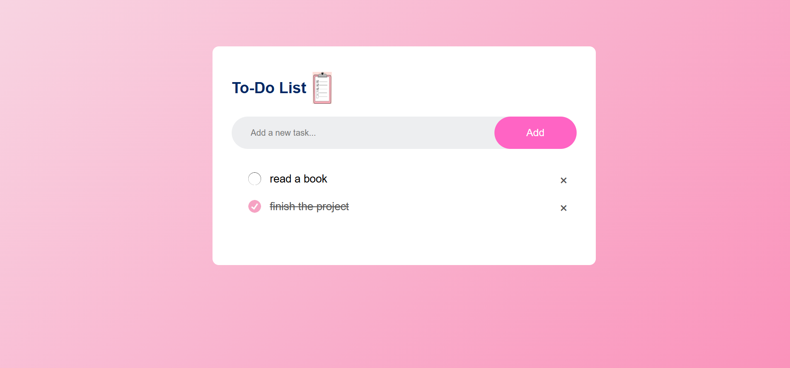

# To-Do List App

A simple, no-frills to-do list web app built from scratch with HTML, CSS, and vanilla JavaScript — no frameworks, no build tools. Add tasks, check them off, delete them, and your list is automatically saved in the browser's local storage, so it's still there the next time you open the page.

This project was built as a practical exercise in core JavaScript fundamentals: DOM manipulation, event handling, and browser storage.

## Screenshot



## Features

- Add new tasks
- Mark tasks as complete by clicking on them
- Delete tasks
- Tasks persist using `localStorage`

## Tech Stack

- HTML
- CSS
- JavaScript (no frameworks)

## Getting Started

No build steps or dependencies required.

1. Clone the repository
   ```bash
   git clone https://github.com/najato8/todo-list-app.git
   ```
2. Open `index.html` in your browser

## Project Structure

```
.
├── index.html    # App markup
├── style.css     # Styling
├── script.js     # App logic (add, complete, delete, save/load tasks)
└── images/       # Icons used in the UI
```

## What I Learned

Building this project helped me practice:

- **DOM manipulation** — creating and inserting elements dynamically with `createElement` and `appendChild` instead of hardcoding markup
- **Event delegation** — using a single click listener on the task list to handle both completing and deleting tasks, based on which element (`<li>` or `<span>`) was actually clicked
- **Persisting state with `localStorage`** — saving the task list on every change and restoring it on page load, so data survives a refresh without a backend
